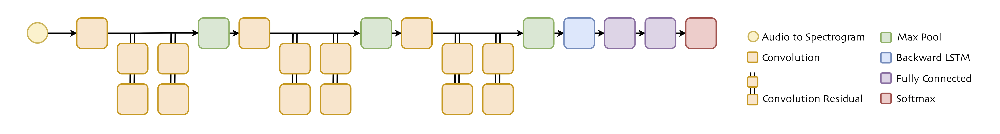

# Kaggle Speech Recognition
This is the project for the Kaggle competition on [TensorFlow Speech Recognition Challenge](https://www.kaggle.com/c/tensorflow-speech-recognition-challenge), to build a speech detector for simple spoken commands.

The model is a Convolution Residual, backward LSTM network using Connectionist Temporal Classification (CTC) cost, written in TensorFlow.

The audio wave files are firstly converted into filter bank spectrograms. CNN layers abstract hierarchical features from spectrogram input, while LSTM layer acts like encoder-decoder, encoding the sequence of CNN features and emitting characters as outputs. The LSTM encoder-decoder is very dynamic. Depending on the training vocabularies, the emitted characters may be encoded with the information of whole words, syllables or just phonemes. Fully connected layers compresses the representations and further decouple characters from the words.

The project is designed to be debugging and visualisation friendly. The interfaces are provided to visualise weights and activations, to log for TensorBoard and to record the learning history of sample words showing how characters and decision boundaries are learnt in training.

### Installation and Usage:
* Prerequisites: Python 3.5,  TensorFlow 1.4; or Python 3.6, TensorFlow 1.7.
* To download the datasets: run [download_dataset.sh](tools/download_dataset.sh).
* To train the network and make inferences: [python train.py](train.py).
* To make inferences: [python predict.py --ckpt check_point](predict.py).

### Dataset, Training and Performance:
[Speech Commands Dataset v0.01](http://download.tensorflow.org/data/speech_commands_v0.01.tar.gz) contains ~64,000 samples of 30 short words from ~1800 speakers. The training data is divided into 5 folds, and no test data is used in training (to proper verify the generalisation of the model). Single training run(~45 epochs of key words + ~6 epochs of unknowns) takes ~60 minutes on Google Cloud compute engines (Nvidia Tesla P100-16GB, Intel Haswell 4vCPUs-26GB, SSD).

The test set has 158,538 samples and new words not seen in the training set. The difference in data distributions (e.g. unseen words, noisy background, unseen speakers) and random samples in the test set (i.e. wrongly-labeled or largely incomplete recording) cause the decline in accuracy from validation (fold distribution dependant) to testing:

| model (Learning_Chars) | Validation: Word/Submission Accuracies | Validation+Training: Word/Submission Accuracies | Test: Public Accuracy (30% of Test Data) |  Test: Private Accuracy (70% of Test Data) | # Private LeaderBoard (Estimate) |
| ----------------- | ----------------- | ----------------- | ----------------- | ----------------- | ----------------- |
| Single run (4/5 of training samples) | 98.14%, 98.47% | 96.190%, 99.658% | 88.240% | 89.357% | 85 |
| Average over 5 folds (runs) | - | 96.650%, 99.729% | 88.706% | 89.874% | 49 |

### Learning Characters(Phonemes) vs Learning Words:
When setting the CTC sequence length to be 1, the model turns from learning individual characters(phonemes) into learning whole words. A quick experiment of this configuration without any hyper-parameter tuning shows performance improvement:

| model (Learning_Words) | Validation: Word/Submission Accuracies | Validation+Training: Word/Submission Accuracies | Test: Public Accuracy (30% of Test Data) |  Test: Private Accuracy (70% of Test Data) | # Private LeaderBoard (Estimate) |
| ----------------- | ----------------- | ----------------- | ----------------- | ----------------- | ----------------- |
| Single run (4/5 of training samples) | 98.57%, 98.65% | 96.469%, 99.454% | 88.760% | 89.416% | 80 |

Though the word-learning models (w-models) outperform the character-learning models in this Kaggle competition (more specifically, the data sets), the character-learning models (c-models) are likely a better fit for practical uses. The reasoning is listed by looking at the limitations and advantages of the c-models compared with the w-models:

Limitations:
* High false negative rate (i.e. the tendency to miss predict key words as unknown words). Simply because it has to get all the characters right to predict the correct word. An ambiguous 'off' sound might be recognised as 'oP' or 'Uf'. A 'seven' with an unheard accent might be predicted as 'sIven'. Averaging over different fold runs sometimes helps.
* More sensitive to incomplete word recordings (both in training and testing). Learning (maybe memorising) ‘LE’ ‘LEF’, 'EFT', etc. as 'LEFT' is harder for c-models than w-models, because c-models has to 'learn' the character that is not there in the sound.. It is quite a random guess in recognizing 'O' as 'go', 'off' or 'on' in the competition.
* Need prior knowledge of pronunciations and preprocessing, as there is no one-to-one mapping between characters and phonemes. But it is possible the models can learn the mapping (and memorizing exceptions) with larger training data.
* In the case of this particular Kaggle competition, the word-character (30-28) ratio is too small for c-models being efficient.

Advantages:
* Generalisation. The c-model is able to learn unseen words, e.g. recognizing 'night' from learning 'NIne' and 'rIGHT', recognizing 'follow' as 'foow' (missing 'l' sound) from learning 'Four' 'dOWn' and 'nO'.
* Easier to scale up to larger vocabularies, with the increase of the number of LSTM hidden units, as well as the increase of the training time when learning longer words. Bi-Directional LSTM will be needed to capture more complex patterns.
* In practise, the property of high false negative (and low false positive) rate is likely a desired feature for key commands detecting applications. It is possible that the models will be customized to end users (with the balance of being general) so that the accents won't be a problem.

