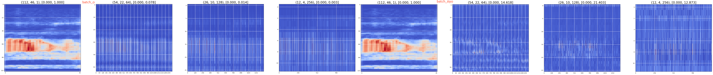
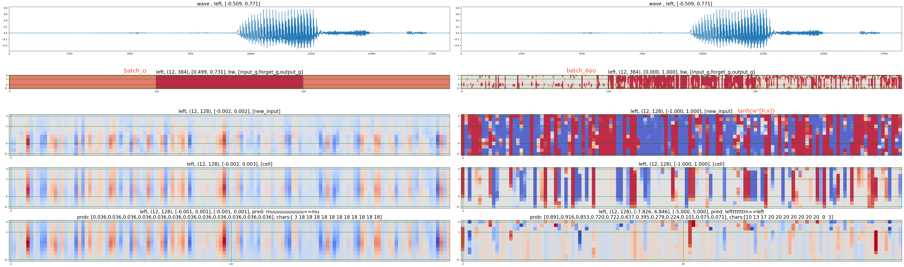
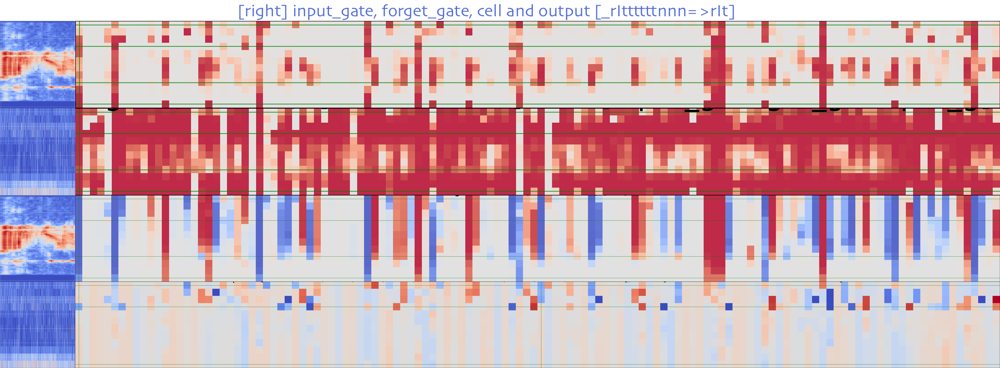
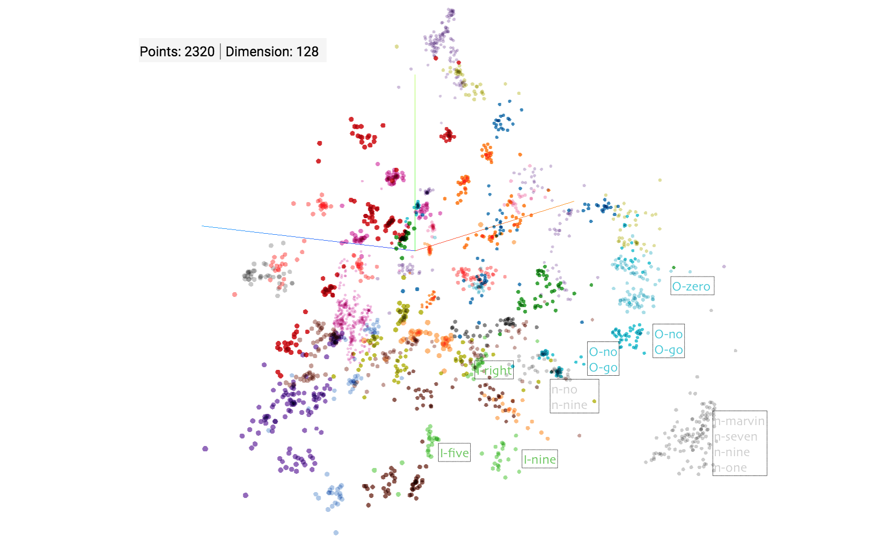

# Visualisation

The convolution layers learn [local features](conv_weights.png) and compressed representations, while the LSTM layers of this network learn to filter out silence, shift phones with order maintained and length adjusted. The phone shifting is shaped by the bean search of CTC. 

LSTM has the capacity of learning complex operations over sequences. In this network,
* Input and forget gates learn to differentiate phones from silence. The weighted phoneme data are accumulated in long-term cells. Different cells have different projections of phone sequences.
* Some input gates are active at the beginning of the sequence (backward LSTM), acting like a counter function to store indexing information in long-term cells.
* Output gates must use both indexes and phoneme sum to generalise and regenerate representations for individual phones.

With CTC loss, the network learns soft boundaries between phones. The same phones from different words and the adjacent phones in same words are both spatially close. The length of phones or silence, frequently edited by LSTM, does not impact CTC loss, which makes the gradient and training stable. 

